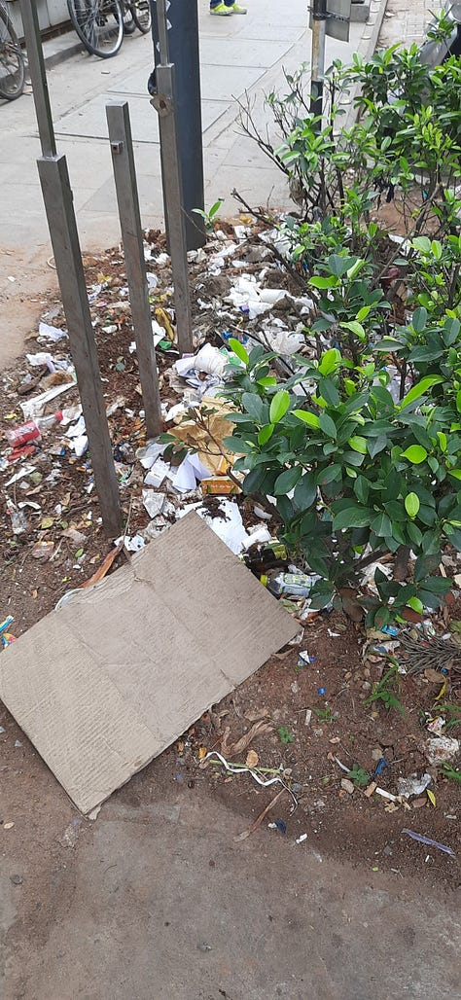
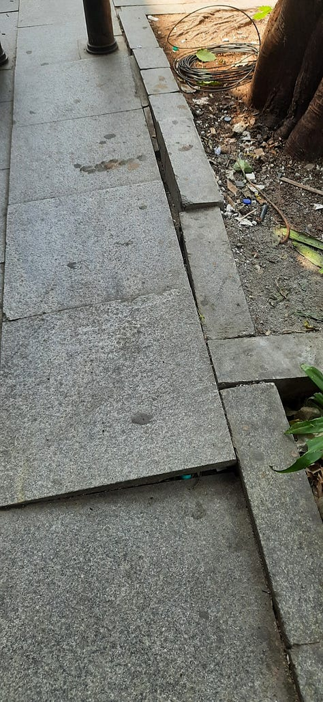
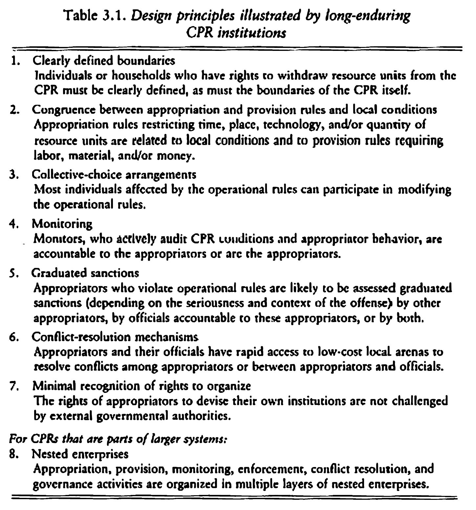

::: {.card-meta}
[Society]{.badge} [state-capacity]{.badge} [governance]{.badge}
:::

> Civil society action, however well-intentioned, cannot substitute the State. Ultimately, there is no replacement for building capacity within the government.

## Origin

The framework draws on Elinor Ostrom's *Governing the Commons* (1990), which won her the Nobel Prize in Economics. Ostrom studied how communities around the world manage shared resources — fisheries, forests, irrigation systems — without either state control or private ownership. Her work challenged the then-dominant view that only hierarchies (the state) or markets could solve collective action problems. The Church Street case discussed below applies Ostrom's principles to urban public space in India.

## What it says

{fig-alt="The State and the Society"}

{fig-alt="The State and the Society (2)"}

{fig-alt="The State and the Society (3)"}

{fig-alt="The State and the Society (4)"}

{fig-alt="The State and the Society (5)"}

{fig-alt="The State and the Society (6)"}

{fig-alt="The State and the Society (7)"}

The relationship between state and society is not a zero-sum choice. Three positions are possible:

**State substitution.** The state does everything — builds, maintains, regulates. When state capacity is high, this works. When it is low, the result is potholes, broken drains, and uncollected garbage.

**Society substitution.** Civil society steps in where the state fails — citizen groups fix roads, clean lakes, run schools. This can produce short-term successes. The problem: the state, seeing society do its job, offloads responsibility permanently. Society becomes a crutch that prevents the state from learning to walk.

**Co-production.** The state and society each do what they are best at. The state sets rules, enforces boundaries, and provides resources. Society monitors, participates, and holds the state accountable. Ostrom's research showed that the most durable commons were governed by local rules designed by the users themselves — but with the state providing the legal backbone and dispute-resolution mechanism.

Ostrom identified eight design principles for enduring institutions:
1. Clearly defined boundaries.
2. Rules adapted to local conditions.
3. Collective-choice arrangements.
4. Monitoring by accountable monitors.
5. Graduated sanctions.
6. Conflict-resolution mechanisms.
7. Recognition of rights to organise.
8. Nested enterprises for larger systems.

## Applied

Church Street in Bengaluru is a clean natural experiment. Before 2018, it was like any other Bengaluru road — potholed, dug up annually, and hostile to pedestrians. A citizen group persuaded the government to adopt TenderSURE standards: integrated utilities, proper drainage, walkable footpaths, and cobbled roads. ₹17 crore and 712 metres later, Church Street became the best street in the city.

The citizen group also arranged for specially appointed engineers to maintain it. For five years, the street worked. Then the maintenance contract was handed over to the BBMP — the municipal corporation. Within months, the street deteriorated. The ward engineer claimed he was not "aware" that Church Street required special maintenance.

The lesson is not that citizen action fails. It is that citizen action succeeds only when it builds state capacity, not when it replaces it. The TenderSURE project should have been a template for training BBMP engineers, not a one-off bypass.

## When it falls short

Ostrom's principles were derived from relatively homogeneous, stable communities managing finite natural resources. Indian cities are hyper-diverse, transient, and politically contested. Applying her principles to a Mumbai street or a Delhi park requires adaptations she did not study — particularly around caste, class, and political patronage.

The framework also risks romanticising "community." Communities can be exclusionary, discriminatory, and captured by local elites.

Finally, the framework does not tell us how to build state capacity when it is absent. If the BBMP does not know how to maintain a road, no amount of Ostromian design will help. Capacity building is a separate, harder problem.

## Related frameworks

- [Radically Networked Societies](radically-networked-societies.qmd) — how digital networks reshape the relationship between state and society.
- [Building Digital Communities](building-digital-communities.qmd) — the online analogue of Ostrom's commons governance.
- [Why Large WhatsApp Groups Are So Ineffective](why-large-whatsapp-groups-are-so-ineffective.qmd) — collective action failures in large groups.

## Further reading

- Ostrom, E. (1990). *Governing the Commons: The Evolution of Institutions for Collective Action*. Cambridge University Press.
- Ostrom, E. (2010). *Beyond Markets and States: Polycentric Governance of Complex Economic Systems*. American Economic Review, 100(3), 641–672.

::: {.attribution}
Originally explored in [*India Policy Watch: The State and the Society*](https://publicpolicy.substack.com/i/130620341/india-policy-watch-the-state-and-the-society) on *Anticipating the Unintended*.
:::
