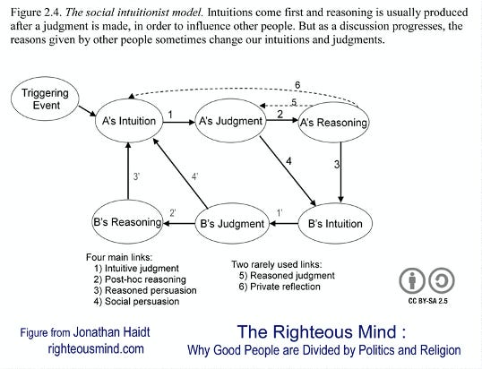

::: {.card-meta}
[Society]{.badge} [behaviour]{.badge} [causality]{.badge}
:::

> Most moral decision-making is either social — based on the views of others — or intuitive, based on gut feelings. Reasoning is what we do after the fact to justify what we have already decided.

## Origin

The Social Intuitionist Model was proposed by psychologist Jonathan Haidt to explain how moral judgments are actually formed. It challenges the rationalist assumption that we reason our way to moral conclusions.

## What it says

{fig-alt="We Hate Cognitive Dissonance"}

Haidt identifies six pathways to moral judgment, of which two dominate:

1. **Intuitive judgment:** A rapid System 1 call made with little conscious effort.
2. **Post-hoc reasoning:** After the judgment, we deploy effortful reasoning to justify a decision already made intuitively.

Social pathways reinforce this: we adopt the intuitions of respected group members without independent reasoning. The model's core claim is that we hate cognitive dissonance — the gap between our intuitive judgment and contradictory evidence — and we resolve it by adjusting our reasoning, not our intuition. Genuine mind-changing through private reflection or reasoned judgment is rare and effortful.

## Applied

- When designing public messaging: facts alone rarely override intuitions; messengers and framing matter more.
- When explaining political polarization: opponents are not missing information; they are filtering it through different intuitive foundations.
- When auditing your own policy arguments: distinguishing genuine reasoning from post-hoc justification.

## When it falls short

The model has been criticised by rationalists for downplaying reason as a tool for moral decision-making. It is also more descriptive than prescriptive: it tells us how judgments form, not how to improve them. Cross-cultural variation in which intuitions are "foundational" complicates universal application.

## Related frameworks

- [[The Basis of Morality]](../society/the-basis-of-morality.qmd) — where moral intuitions come from.
- [[Three Truths of Ideology]](../society/three-truths-of-ideology.qmd) — how ideologies structure intuitive moral landscapes.
- [[How Social Norms Flip]](../society/how-social-norms-flip.qmd) — social persuasion as a mechanism of norm change.

## Further reading

- Haidt, J. *The Emotional Dog and Its Rational Tail*.
- [Balanced critique](https://www.cambridge.org/core/journals/behavioral-and-brain-sciences/article/emotional-dog-and-its-rational-tail-a-social-intuitionist-approach-to-moral-judgment/416129745550B1A2C84C429D11A7B4B8) in *Behavioral and Brain Sciences*.
- [Original newsletter essay](https://publicpolicy.substack.com/p/34-east-is-east-and-west-is-west)

::: {.attribution}
Originally explored in [*A Framework a Week: We Hate Cognitive Dissonance*](https://publicpolicy.substack.com/p/34-east-is-east-and-west-is-west) on *Anticipating the Unintended*.
:::
