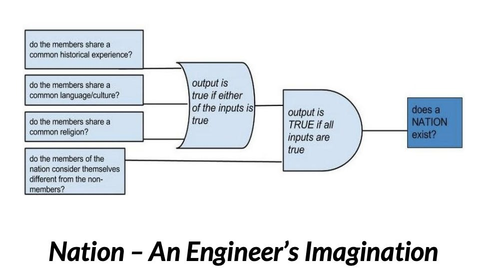

::: {.card-meta}
[Society]{.badge} [nationalism]{.badge} [political-theory]{.badge}
:::

> A nation is an imagined community — imagined by people who believe they belong to it while being different from other such communities.

## Origin

The framework draws on Benedict Anderson's *Imagined Communities* (1983), the most influential account of nationalism in the last half-century. Anderson argued that nations are not natural or primordial entities but socially constructed communities whose members will never meet most of their fellow members, yet hold a shared image of their communion.

## What it says

{fig-alt="What is a Nation?"}

Every newly independent nation faces a paradox: the objective modernity of the nation to the historian's eye versus its subjective antiquity in the eyes of nationalists. Anderson identified three moves that nation-builders make to resolve this:

**1. A break from the past.** New nations present independence as a rupture — a "blasting open of the continuum of history." The American Declaration of Independence made no reference to Columbus or the Pilgrim Fathers. It was a deliberate new beginning.

**2. The reawakening trope.** Older nations, or those with histories too long to wish away, use a different framing: not a break, but an awakening from slumber. The nation was always there, merely dormant.

**3. Historians rewrite history.** Once the narrative is chosen, historians are pressed into service to reframe the past. They speak for the dead, ascribing to them desires they never articulated, so that past events appear to serve the nation-building objectives of the present.

India at independence made all three moves. It presented 1947 as a break from colonial rule (Move 1). Nehru's "Tryst with Destiny" speech positioned it as an awakening — "India will awake to life and freedom" (Move 2). Historians then constructed a linear narrative of freedom struggle, selective in what it memorialised and what it airbrushed (Move 3).

## Applied

The framework explains why disputes over history textbooks, monuments, and national symbols are not academic quibbles. They are contests over the imagination of the nation itself. The alternative imagination — of India as a civilisational state suppressed by foreign invaders for a millennium — did not die out. It remained subdued, and has now re-emerged as a competing narrative with its own political mandate.

Any attempt to formalise a change in national imagination will repeat the original sequence: constitutional amendments signalling departure, a reframing of the last decades as slumber, and a reworking of history.

## When it falls short

Anderson's framework is better at explaining how nations are imagined than at predicting which imagination wins. It does not tell us what price a change in imagination extracts from a society, or whether one imagination is materially better for prosperity and stability than another.

## Related frameworks

- [The State and the Society](the-state-and-the-society.qmd) — the institutional expression of national imagination.
- [Three Truths of Ideology](three-truths-of-ideology.qmd) — how ideological commitments structure collective identity.

## Further reading

- Anderson, B. (1983). *Imagined Communities: Reflections on the Origin and Spread of Nationalism*. Verso.
- Gellner, E. (1983). *Nations and Nationalism*. Cornell University Press.

::: {.attribution}
Originally explored in [*A Framework a Week: What is a Nation?*](https://publicpolicy.substack.com/i/884531/addendum) on *Anticipating the Unintended*.
:::
