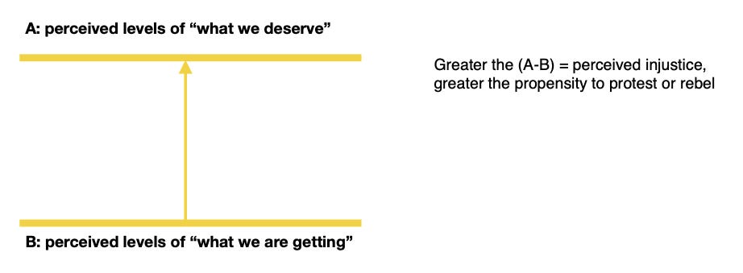

::: {.card-meta}
[Society]{.badge} [mobilisation]{.badge} [grievance]{.badge}
:::

> The greater the difference between people's perception of 'what we deserve' and 'what we are getting', the higher their propensity to protest or rebel.

## Origin

The framework comes from Ted Gurr's 1970 book *Why Men Rebel?* Gurr was trying to explain why some societies with objectively severe deprivation remain stable, while others with relatively mild grievances explode into violence. His answer was that the relevant variable is not absolute deprivation but **relative deprivation** — the perceived gap between expected and actual outcomes.

## What it says

{fig-alt="Why People Rebel"}

Gurr's model has three components:

**Value expectations.**
What people believe they are entitled to. These expectations are shaped by past experience, comparison with reference groups, and culturally transmitted beliefs about justice. A government employee who sees colleagues retire on inflation-linked pensions develops an expectation that the same awaits him. The expectation is not arbitrary; it is anchored in lived reality.

**Value capabilities.**
What people believe they can actually attain. This is shaped by their assessment of their own resources, the openness of the system, and the perceived costs of action. If employees believe the pension fund is poorly managed and their returns will be low, their value capabilities shrink.

**Relative deprivation.**
The gap between expectations and capabilities. When the gap is small or negative (people are doing better than expected), society is stable. When the gap is large and positive (people are doing worse than they believe they deserve), the propensity to collective violence rises.

Gurr's key insight is that **the gap matters more than the level**. A poor society where everyone is equally poor may be stable. A society where some are getting richer while others stagnate is volatile, even if the stagnating group is objectively better off than in the past.

## Applied

The rollback of pension reforms in Rajasthan and Chhattisgarh in 2022 is a textbook case. In 2004, the government shifted new employees to a defined-contribution pension scheme (NPS), ending the unsustainable defined-benefit system. The reform was designed to align cognitive maps: new employees got a salary hike, existing employees were untouched, and the armed forces were exempt.

Eighteen years later, the first NPS retirees began receiving pensions significantly smaller than their older counterparts. The value expectation ("I deserve what the previous generation got") collided with value capabilities ("my pension is smaller because of implementation delays and market returns"). The relative deprivation gap widened. Employees protested. State governments, facing elections, rolled back the reform — imposing the cost on future taxpayers who have no voice.

The framework suggests two political strategies to manage relative deprivation:

1. **Raise capabilities:** Fix implementation, improve fund management, and communicate the full value of the package (including the employer contribution and tax benefits).

2. **Lower expectations:** Create a narrative about fiscal sustainability and intergenerational fairness — difficult, but possible with sustained political effort.

The Indian government did neither. It assumed the 2004 reform was a done deal and stopped managing the politics. The result: a promising policy success became a policy failure.

## When it falls short

Gurr's framework is primarily psychological. It explains why individuals feel aggrieved, but not why those grievances translate into organised collective action. Many people feel relative deprivation every day; very few rebel. The missing link is mobilisation — leadership, networks, resources, and opportunity. The framework needs to be paired with organisational analysis to explain when grievance becomes movement.

It also struggles with cases where rebellion occurs in the absence of relative deprivation. The 2020-21 farmers' protests were not driven by a gap between expectations and outcomes; they were driven by a fear of future loss — the prospective dismantling of a familiar system. Gurr's framework is backward-looking; some mobilisation is forward-looking.

## Related frameworks

- [Radically Networked Societies](radically-networked-societies.qmd) — how digital networks lower the organisational costs of mobilisation.
- [How Social Norms Flip](how-social-norms-flip.qmd) — changing collective behaviour through sequenced deterrence.
- [The Overton Window](../political-thinking/overton-window.qmd) — how the bounds of acceptable political action shift over time.

## Further reading

- Gurr, T. R. (1970). *Why Men Rebel*. Princeton University Press.

::: {.attribution}
Originally explored in [*PolicyWTF: Pension Troubles are Back*](https://publicpolicy.substack.com/i/50638070/policywtf-pension-troubles-are-back) on *Anticipating the Unintended*.
:::
