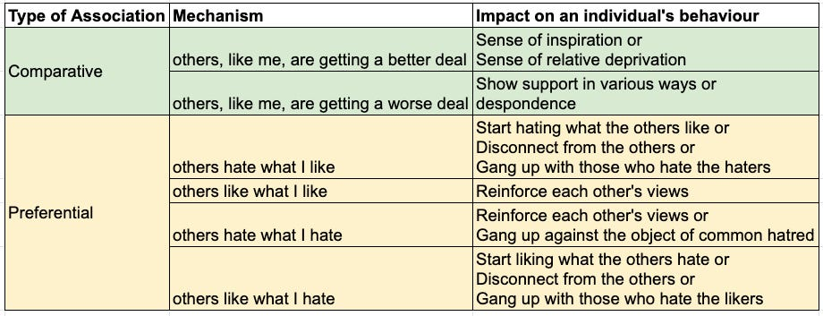

::: {.card-meta}
[Universe]{.badge} [social media]{.badge} [behaviour]{.badge}
:::

> Our reference network comprises people whose beliefs and behaviour matter for our behaviour. Social media expands it as people worldwide can now instantly and repeatedly influence our perceptions.

## Origin

The framework emerged from an effort to explain why social media is politically powerful. The initial claim identified three meta-mechanisms: reference network expansion, Overton window expansion, and disproportional rewards for extreme content. This card unpacks the first — the quiet way platforms change whom we take our cues from.

## What it says

{fig-alt="How Social Media Expands Reference Networks"}

A reference network is the set of people you compare yourself against and whose preferences shape your own. Before social media, this network was small and local: neighbours, colleagues, family. Platforms have exploded its scale and altered its composition through two distinct mechanisms.

**Comparative association.** We measure ourselves against people we imagine to be similar to us. Social media multiplies the pool of possible comparators from dozens to millions. A student in Indore now compares her life not with classmates but with curated strangers in London and Seoul.

**Preferential association.** Our behaviour is shaped by the likes and dislikes of others we encounter online. Echo chambers are merely two variants of this: "others like what I like" and "others hate what I hate." But there are at least four other preferential mechanisms, which means echo-chamber talk captures only a fraction of what is going on.

The result is that purely domestic issues acquire global resonance, and people develop strong emotional stances toward individuals they have never met and never will.

## Applied

The framework explains why online movements scale so fast and feel so personal. When a reference network expands, status anxiety increases because the denominator of comparison grows while your position in it shrinks. This drives both the performative outrage and the identity-based solidarity that characterise platform politics.

For policymakers, the implication is that regulating content alone misses the deeper structural change. The reference network itself has been rewired. Any policy that treats social media as merely a faster newspaper misunderstands the transformation.

## When it falls short

The framework treats reference network expansion as largely symmetric: everyone gains influence over everyone else. In practice, platforms amplify some voices algorithmically, so the expansion is hierarchical, not flat. It also does not explain why some issues activate network expansion while others fail to travel. The mechanism is descriptive, not predictive.

## Related frameworks

- [Overton Window](../political-thinking/overton-window.qmd) — the second meta-mechanism: how platforms shift the boundaries of acceptable opinion.
- [Radically Networked Societies](../society/radically-networked-societies.qmd) — the structural consequences of living inside expanded networks.

::: {.attribution}
Originally explored in [*A Framework a Week: How Social Media Expands our Reference Networks*](https://publicpolicy.substack.com/i/63263132/global-policy-watch-how-social-media-expands-our-reference-networks) on *Anticipating the Unintended*.
:::
