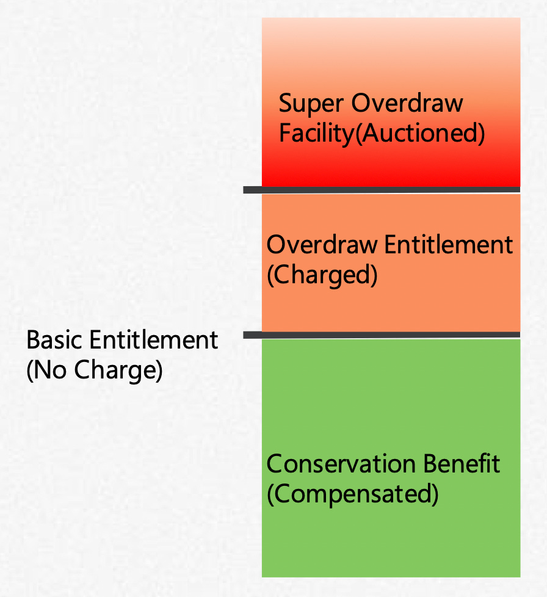
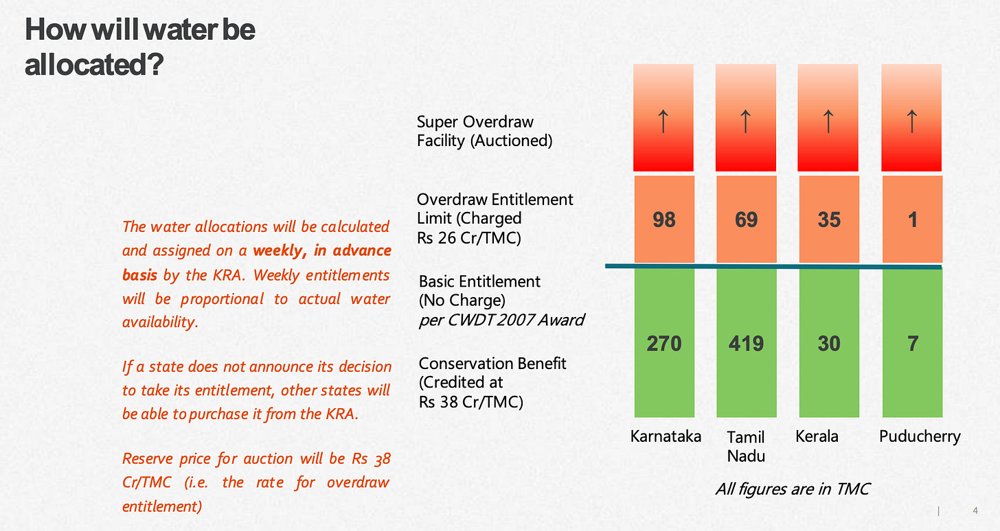

::: {.card-meta}
[Universe]{.badge} [water]{.badge} [federalism]{.badge}
:::

> The current method of relying on tribunal-generated administrative allocations angers all and satisfies none. Yet it continues, and there is no alternative mechanism for the states to compensate each other.

## Origin

This framework was developed by a team at the Takshashila Institution in 2017 as a response to the recurring Kaveri dispute. The insight was that water allocation in India is treated as a zero-sum legal battle rather than a shared-resource management problem. The proposal offered an incentive-based alternative to the tribunal model.

## What it says

{fig-alt="Inter-State Water Sharing"}

{fig-alt="Inter-State Water Sharing (detail)"}

The framework replaces court-ordered fixed allocations with a three-tiered, pricing-based system managed by an independent water authority.

**Basic entitlement.** Each state can draw water up to its basic entitlement free of charge. This guarantees a minimum supply for livelihoods and essential use.

**Overdraw entitlement.** Water drawn beyond the basic entitlement is charged at fixed rates. This introduces marginal pricing without denying access.

**Super overdraw facility.** Additional water is allocated through competitive auctions. States that value water most highly pay for the privilege, and the revenue feeds back into the system.

**Conservation incentive.** States that draw less than their basic entitlement receive compensation for the unused portion. This turns conservation from a noble intention into a budget line.

The authority is capitalised by an initial corpus from the Union government and the riparian states, and becomes self-sustaining through the charging mechanism.

## Applied

The Kaveri dispute repeats because the tribunal model produces binary winners and losers with no flexibility for rainfall variability. A pricing mechanism would let a water-surplus state like Karnataka sell conservation credits to a deficit state like Tamil Nadu in dry years, turning conflict into trade.

The framework generalises to any federal system where rivers cross boundaries and historical entitlements have hardened into political identity. The key shift is from rights-based allocation to exchange-based management.

## When it falls short

The framework assumes an independent authority with enforcement capacity — a tall order in Indian federalism where water is a state subject and political incentives favour maximalist claims. It also treats surface water in isolation, while groundwater exploitation increasingly undermines any surface allocation. Finally, water has sacred and emotional valence in India; a pricing mechanism can be framed as commodification and defeated on moral grounds regardless of its efficiency.

## Related frameworks

- [Wicked Problems](../public-policy/wicked-problems.qmd) — water disputes are a textbook case: no stopping rule, no single correct formulation, and solutions have downstream consequences.
- [Algorithm for Fiscal Federalism](../public-finance/algorithm-for-fiscal-federalism.qmd) — the institutional design problem of assigning authority across levels of government.

## Further reading

- Takshashila Institution, *Kaveri Dynamic Water Management & Livelihood Protection System* (2017).

::: {.attribution}
Originally explored in [*A Framework a Week: Inter-State Water Sharing*](https://publicpolicy.substack.com/i/137520569/india-policy-watch-same-old-stock-responses) on *Anticipating the Unintended*.
:::
