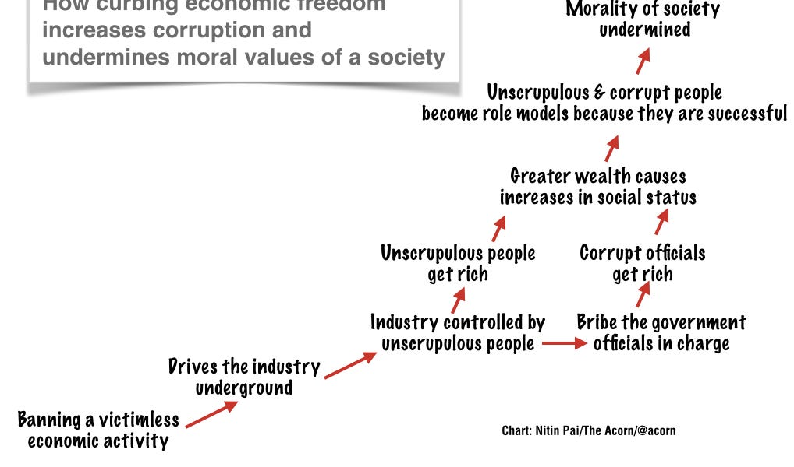

::: {.card-meta}
[Universe]{.badge} [prohibition]{.badge} [unintended consequences]{.badge}
:::

> The successful and respected people in the society were the ones whose only competence was breaking the law.

## Origin

The framework crystallises around two historic Indian prohibitions: Morarji Desai's Bombay Prohibition Act of 1949 and the Gold (Control) Act of 1968. Both were defended on moral grounds. Both produced identical pathologies: black markets, corruption, and an inversion of social status.

## What it says

{fig-alt="Prohibition and Morality"}

Legal restriction and ethical claim are frequently conflated, but they operate on different logics. Morality is a social norm. Prohibition is a state intervention. When the two align — murder is both immoral and illegal — the law reinforces an already stable equilibrium. When they diverge — alcohol or gold are morally contested but legally banned — the law creates a demand for lawbreaking.

Three patterns follow.

**Diversion of state capacity.** Prohibition requires elaborate enforcement machinery. The Bombay Prohibition Act granted officers warrantless search and arrest powers, created a parallel system outside the standard penal code, and redirected policing capacity from protecting victims to apprehending tipplers.

**Substitution to worse alternatives.** When legal supply is cut, demand does not vanish. It migrates. After prohibition, India saw a proliferation of "tinctures" — alcohol-based medical preparations with no genuine therapeutic use. After gold control, smuggling became a national industry.

**Moral inversion.** The general equilibrium effect is the most damaging. When a widely desired good is banned, the people who thrive are those skilled at evasion. Over time, lawbreaking becomes not just profitable but socially respectable. The boundary between legitimate commerce and crime blurs.

## Applied

Contemporary alcohol bans in Bihar, Gujarat, and other states replay the Bombay script: hooch tragedies, bootlegger networks, and police corruption. Drug prohibition globally follows the same arc. The framework suggests a diagnostic test: before banning a victimless activity, ask whether the enforcement machinery you are about to create is morally preferable to the activity itself.

## When it falls short

Not all prohibited acts are victimless. Drunk driving, environmental dumping, and child labour impose harms on third parties. The framework applies to cases where the primary justification is moral disapproval of voluntary exchange or consumption. It also does not answer the question of regulation short of prohibition — taxation, licensing, and harm reduction are middle paths the framework does not adjudicate among.

## Related frameworks

- [Moralising is Central to Storytelling](moralising-is-central-to-storytelling.qmd) — how moral claims are weaponised in political narratives.
- [The Basis of Morality](../society/the-basis-of-morality.qmd) — where moral intuitions come from before they are codified into law.

## Further reading

- De, R. (2018). *The People's Constitution*. Yale University Press.

::: {.attribution}
Originally explored in [*A Framework a Week: Prohibition and Morality*](https://publicpolicy.substack.com/i/31560112/policywtf-prohibition-and-morality) on *Anticipating the Unintended*.
:::
