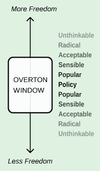

::: {.card-meta}
[Universe]{.badge} [social-media]{.badge} [information]{.badge}
:::

> Many real-life events attributed to social media can be explained by a combination of three mechanisms: expanded reference networks, stretched Overton Windows, and disproportionate rewards for extreme content.

## Origin

The framework is Pranay's synthesis of sociological and cognitive research on information-age behaviour, drawing particularly on Zeynep Tufekci's work on networked protest and persuasion, and on basic information theory. It was developed to move beyond the common but partial explanations of social media's harms — echo chambers, algorithms, ad-based business models — and instead identify the meta-mechanisms that operate across all platforms.

## What it says

{fig-alt="Social Media's Rule of Three"}

Three interrelated mechanisms make social media a uniquely powerful instrument for shaping belief and behaviour:

**Mechanism 1: Expanded reference networks.**
For most of human history, your reference network — the people whose beliefs and behaviour shape your own — was determined by geographic proximity. Social media has severed that link. Your reference network now includes people across the world who can influence your perceptions instantly and repeatedly.

Crucially, this is not the same as an echo chamber. Research shows that we probably encounter a wider variety of opinions online than offline. The problem is not that we never hear opposing views. It is that when we do, we hear them while sitting with our team in a football stadium, not while reading a newspaper alone. We bond with our in-group by yelling at the out-group. Belonging is stronger than facts.

**Mechanism 2: Stretched Overton Windows.**
The Overton Window — the range of socially acceptable positions on any issue — has been stretched so wide that nearly all possible positions have become sayable. With old gatekeepers (newspapers, parties, religious institutions) no longer wielding the same authority, the range of opinions on any issue is extremely broad. Each view attracts its own reference network. The result: the social acceptability window becomes broader at the poles, making extreme positions electorally viable and socially normal.

**Mechanism 3: Disproportionate rewards for extreme content.**
Persuasion requires attention. Attention is scarce in a crowded information environment. The only reliable way to attract it is to be surprising and shocking. From an information-theory perspective, common events carry low information content; shocking events carry high information content. A routine bomb blast in Kabul carries less information (and less engagement) than a surprising claim about election interference. Over time, content creators learn that moderation is invisible and extremity is rewarded. The feed becomes broader at the poles and thinner in the middle.

## Applied

The three mechanisms explain events that otherwise seem inexplicable. The DRASTIC group's success in shifting the COVID-origins conversation in 2021 is a clean case: an expanded reference network allowed geographically dispersed researchers to build on each other's work; a stretched Overton Window meant the lab-leak hypothesis could be voiced without immediate dismissal; and the surprising nature of the claim gave it viral traction across platforms.

In Indian politics, the same three mechanisms explain why a fringe position on a religious issue can become mainstream within weeks. The reference network expands through WhatsApp forwards. The Overton Window stretches as influencers test the boundaries. And the most extreme version of the claim — the one that generates the most shock — travels farthest.

## When it falls short

The framework describes structural tendencies, not deterministic laws. Not all social media content drifts to extremes. Some platforms and some communities maintain norms of civility and evidence. The framework cannot predict which communities will resist the pull.

It also treats the three mechanisms as independent when they clearly interact. Expanded reference networks stretch the Overton Window; a stretched Overton Window creates space for more extreme content; extreme content attracts larger reference networks. The feedback loops matter, and the framework does not model them dynamically.

Finally, the framework is silent on platform design. Different platforms amplify the three mechanisms to different degrees. Twitter's character limit and retweet function reward brevity and virality. YouTube's recommendation algorithm rewards watch time, which often means outrage. WhatsApp's encrypted closed groups create different dynamics entirely. The framework operates above the platform level.

## Related frameworks

- [How Social Media Expands Reference Networks](how-social-media-expands-reference-networks.qmd) — a deeper dive into Mechanism 1.
- [The Overton Window](../political-thinking/overton-window.qmd) — the underlying concept behind Mechanism 2.
- [Internet and Politics](../society/internet-and-politics.qmd) — the six pathways of digital political influence.

## Further reading

- Tufekci, Z. (2017). *Twitter and Tear Gas: The Power and Fragility of Networked Protest*. Yale University Press.

::: {.attribution}
Originally explored in [*Global Policy Watch: Social Media's Rule of Three*](https://publicpolicy.substack.com/i/59994095/global-policy-watch-social-medias-rule-of-three) on *Anticipating the Unintended*.
:::
