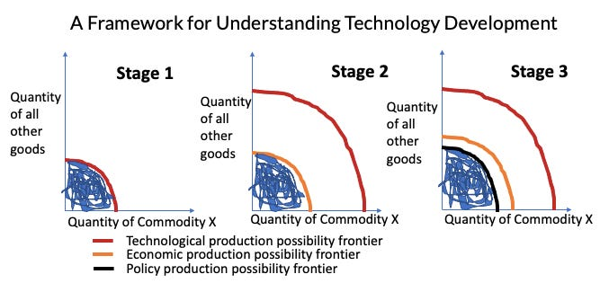

::: {.card-meta}
[Universe]{.badge} [innovation]{.badge} [regulation]{.badge}
:::

> A technology can be technically possible, economically unviable, and legally prohibited at different points in its life. The binding constraint at any moment shapes what kind of work matters — engineering, business model design, or political advocacy.

## Origin

This framing is Pranay's adaptation of an argument made by Brian Potter in his essay *[Why Skyscrapers Are So Short](https://www.construction-physics.com/p/why-skyscrapers-are-so-short)* in *Works in Progress*. Potter's puzzle was that the world's tallest buildings have plateaued for decades despite continued technical capacity to go higher. His answer: the constraint on building height has moved, over time, from technology to economics to policy.

The three-constraint frame generalises beyond skyscrapers. It is a useful diagnostic tool for thinking about any technology, applied through the simple device of a *production possibility frontier* (PPF) — the boundary of what can actually be built or deployed at a given time.

## What it says

{fig-alt="Three Binding Constraints on Technological Progress"}

Three frontiers sit one inside the other. Each becomes the binding constraint at a different stage of a technology's life.

**1. The technological PPF.** In the early life of a technology, the constraint is the technology itself. Bugs are unsolved, components do not exist, performance is unreliable. No matter how much capital is available or how permissive the regulation, the artefact simply cannot do the job yet. Engineering work dominates.

**2. The economic PPF.** As the technology matures, what is technically possible begins to outrun what is economically viable. The cost curve has not yet bent enough to make the technology competitive with incumbent alternatives. The binding constraint shifts: we know how to build it, but no one will pay enough to make it worth building. Work shifts to scaling, supply chains, and business model invention.

**3. The policy PPF.** As the technology becomes cheap and reliable, the binding constraint shifts again — to law, regulation, public acceptance, and the political economy of incumbents. The technology is ready, the market wants it, but the legal regime says no, or has not yet figured out how to say yes.

```{=html}
<div style="margin: 1.5rem 0; font-family: var(--bs-font-sans-serif);">
  <div style="display:flex; gap:0.75rem; align-items:stretch;">
    <div style="flex:1; border:2px solid #1a4480; border-radius:6px; padding:1rem; position:relative;">
      <div style="position:absolute; top:-0.7rem; left:0.75rem; background:#fff; padding:0 0.3rem; font-size:0.7rem; color:#1a4480; font-weight:600; text-transform:uppercase; letter-spacing:0.05em;">Policy PPF</div>
      <div style="border:2px solid #4472a8; border-radius:4px; padding:0.75rem; margin-top:0.25rem; position:relative;">
        <div style="position:absolute; top:-0.65rem; left:0.75rem; background:#fff; padding:0 0.3rem; font-size:0.7rem; color:#4472a8; font-weight:600; text-transform:uppercase; letter-spacing:0.05em;">Economic PPF</div>
        <div style="border:2px solid #88a8d0; border-radius:4px; padding:0.75rem; margin-top:0.25rem; text-align:center; font-size:0.85rem; color:#555;">
          <strong style="color:#1a4480;">Technological PPF</strong><br>
          <span style="font-size:0.8rem;">what the technology can actually build</span>
        </div>
      </div>
    </div>
    <div style="display:flex; flex-direction:column; justify-content:space-evenly; font-size:0.8rem; color:#555; min-width:160px;">
      <div><span style="color:#1a4480; font-weight:600;">→ Policy frontier</span><br>regulation, incumbents</div>
      <div><span style="color:#4472a8; font-weight:600;">→ Economic frontier</span><br>cost, business model</div>
      <div><span style="color:#88a8d0; font-weight:600;">→ Technical frontier</span><br>engineering, R&D</div>
    </div>
  </div>
  <div style="font-size:0.75rem; color:#aaa; margin-top:0.5rem;">The innermost frontier is the binding constraint. Work that hits an outer wall first is wasted.</div>
</div>
```

A technology can be stuck against any one of these frontiers. The kind of intervention required is completely different in each case. Spending more on R&D when the binding constraint is policy is wasted effort. Lobbying for deregulation when the binding constraint is still cost is premature.

## Applied

Cryptocurrency illustrates the sequence cleanly.

In its first years, the binding constraint was **technological**. The cryptography worked, but transaction throughput, wallet security, and network reliability were poor. Engineering effort drove the field forward.

By the late 2010s, the binding constraint had moved to **economic**. The technology functioned, but mining costs, transaction fees, and price volatility kept it on the fringe of mainstream payment use. Business model innovation — exchanges, custody services, stablecoins, layer-2 protocols — became the locus of effort.

By the 2020s, the binding constraint shifted decisively to **policy**. What crypto could and could not legally do, where it could be held, how it interacted with banking and securities law, became the dominant question. The interesting work moved from coding to litigation and lobbying.

The same three-stage progression can be read in solar power, electric vehicles, drone delivery, autonomous driving, and gene editing. Each moves through technology → economics → policy, and the field's frustrations at any moment usually point to whichever frontier is currently binding.

The framework's diagnostic value: before recommending what to do about a stuck technology, ask which frontier is actually binding. Misdiagnosing the binding constraint is the most common reason that well-intended interventions go nowhere.

## When it falls short

The three frontiers are not always sequential. Some technologies hit policy resistance before they have crossed the cost frontier (CRISPR germline editing). Some hit economic limits before the technical work is done (fusion). The neat ordering is a stylised pattern, not a law.

The framework also treats the three frontiers as independent. In practice, policy shapes the cost curve (subsidies, tax credits, mandates), and cost shapes politics (cheaper rooftop solar reshaped the political coalition for renewables). A more complete account would let the frontiers move each other.

Finally, the framework looks at a single technology in isolation. Real technological progress is ecosystem-level: a new technology often unblocks others. Looking only at one PPF can miss the systemic story.

## Related frameworks

- [How to Build a Good 2x2 Matrix](how-to-build-a-good-2x2-matrix.qmd) — a complementary tool for diagnosing what is binding.
- [Building Models](building-models.qmd) — the underlying craft of constructing simple frameworks like this one.

## Further reading

- Brian Potter, *[Why Skyscrapers Are So Short](https://www.construction-physics.com/p/why-skyscrapers-are-so-short)*, Works in Progress.
- Brian Potter, *Construction Physics* — long-running blog on the political economy of building.

::: {.attribution}
Originally explored in [*A Framework a Week: The Three Binding Constraints on Technological Progress*](https://publicpolicy.substack.com/i/51900966/a-framework-a-week-the-three-binding-constraints-on-technological-progress) on *Anticipating the Unintended*.
:::
