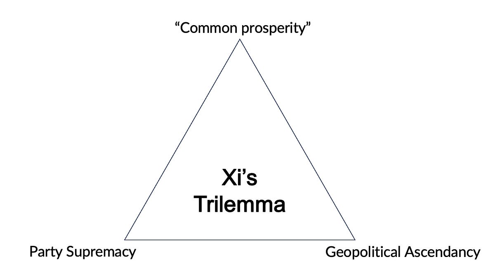

::: {.card-meta}
[Universe]{.badge} [China]{.badge} [geopolitics]{.badge}
:::

> It can only achieve any two out of these three. But it wants them all.

## Origin

The framework emerged from an analysis of China's 2024 economic predicament: a property market in deep funk, consumer confidence collapsed, export markets pushing back against overcapacity, and stimulus measures that treat symptoms rather than causes. Beneath the surface turbulence sits a structural trilemma of Xi's own making.

## What it says

{fig-alt="Xi's Trilemma"}

China under Xi is pursuing three objectives simultaneously. Standard macroeconomic logic says it can have two. The third must be sacrificed.

**Party dominance.** Xi wants the Chinese Communist Party to remain supreme over the private sector and society. Market forces are permitted only insofar as they can be managed, redirected, or shut down by the party. The anti-corruption campaigns, the tech-sector crackdowns, and the "common prosperity" rhetoric all serve this goal.

**Sustained growth.** Growth requires private capital, entrepreneurial risk-taking, foreign investment, and free access to global markets. These are conditions the party finds threatening because they create autonomous centres of wealth and opinion outside party control.

**Superpower status.** This entails territorial claims (Taiwan, South China Sea), technological leadership (AI, EVs, green energy), replacement of the dollar with the yuan, and demonstration of the superiority of China's political model. Each of these ambitions provokes pushback from the incumbent superpower and its allies.

The trilemma is that party dominance starves the private sector and frightens foreign capital, undermining growth. Growth, if prioritised, would require relaxing party control and accepting geopolitical accommodation. Superpower ambition accelerates decoupling and closes markets, hurting growth. Pick any two.

## Applied

The framework explains why China's stimulus packages repeatedly disappoint. Monetary easing and property market support cannot restore animal spirits when the underlying constraint is political. Entrepreneurs do not invest when the rules can change overnight. Foreign capital does not return when executives can disappear. Until Xi chooses which of the three to downgrade, the economy will remain stuck.

For India's strategists, the implication is that China's external aggression is likely to increase as its economic performance weakens. The worse the growth numbers, the greater the need for nationalist spectacle to demonstrate strength domestically.

## When it falls short

The framework treats the three goals as equally weighted and mutually exclusive. In reality, Xi may be willing to accept slower growth for longer than the framework assumes. It is also static: political economies can shift the trade-off surface through institutional innovation, though there is little evidence China is doing so. Finally, it does not predict *which* two will be chosen — only that all three is impossible.

## Related frameworks

- [Decoupling Dynamics](../foreign-policy-defence-geopolitics/decoupling-dynamics.qmd) — how the US-China technological separation is unfolding across nine layers.
- [China's Predicament](../foreign-policy-defence-geopolitics/chinas-predicament.qmd) — the domestic political constraints that prevent China from resolving the trilemma.
- [Three Binding Constraints on Technological Progress](three-binding-constraints-tech-progress.qmd) — a parallel framework for diagnosing what is binding in a technology's path to deployment.

::: {.attribution}
Originally explored in [*A Framework a Week: Xi's Trilemma*](https://publicpolicy.substack.com/i/149522469/global-policy-watch-not-stimulating-enough) on *Anticipating the Unintended*.
:::
